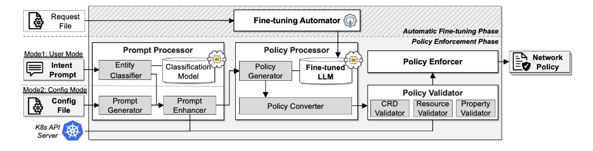

# KubeTeus



KubeTeus is an intent-driven, LLM-powered network policy generation framework for Kubernetes. It enables users to generate and enforce network security policies from natural language prompts or Pod/Deployment Configuration File, without requiring deep knowledge of Kubernetes or CNI specifications.

> This project was presented at **IEEE INFOCOM 2025** as 
**"KUBETEUS: An Intelligent Network Policy Generation Framework for Containers".**


## ✨ Key Features
- **Intent-Based Generation**: Converts plain English into Kubernetes-compatible network policies using fine-tuned Large Language Models (LLMs). (BLEU ↑ 360%, ROUGE ↑ 233%)

- **CNI-Agnostic Support**: Supports multiple CNIs (e.g., Calico, Cilium, Kubernetes native), automatically adapting to installed environments.

- **Real-Time Cluster Awareness**: Dynamically queries current resource status to build accurate prompts.

- **Multi-Step Validation**: Prevents misconfiguration with CRD schema check, live resource matching, and policy correctness verification.

- **Automatic Fine-Tuning**: Includes tools for LLM fine-tuning using domain-specific datasets.

## 🚀 Getting Started

### Prerequisites
- go version v1.23.0+
    - ✅ `export PATH=$PATH:/usr/local/go/bin`
- docker version 17.03+.
- kubectl version v1.11.3+.
- Access to a Kubernetes v1.11.3+ cluster.

### ⚙️ Python Setup
To use the local entity classifier module and LLM execution server, set up a Python virtual environment and install the required dependencies.

#### 1. Create a Virtual Environment
```
$ sudo apt install -y python3-pip python3-venv
$ python3 -m venv kubeteus
$ source kubeteus/bin/activate
```

#### 2. Install Required Libraries
```
$ pip install pandas numpy scikit-learn scipy matplotlib flask transformers
```

#### 3. Hugging Face Login (Optional, if using private models)
```
$ huggingface-cli login
```

### 🧪 Sample Application Setup
Deploy a reference microservice app: 
- Google Cloud's [Online Boutique](https://github.com/GoogleCloudPlatform/microservices-demo)
- Istio's [Bookinfo Application](https://github.com/istio/istio/blob/master/samples/bookinfo/README.md)
- Cisco's [Martian Bank](https://github.com/cisco-open/martian-bank-demo)

For Example, 
```
$ git clone https://github.com/GoogleCloudPlatform/microservices-demo.git
$ cd microservices-demo/release
$ kubectl apply -f kubernetes-manifests.yaml
$ kubectl get pod
NAME                                     READY   STATUS    RESTARTS   AGE
adservice-5b575d9444-plvfq               1/1     Running   0          3m12s
cartservice-7f7b9fc469-k4sx6             1/1     Running   0          3m13s
checkoutservice-6bbccb4788-cw66j         1/1     Running   0          3m13s
currencyservice-795445fcb8-84czn         1/1     Running   0          3m12s
emailservice-c498b5f8b-6hkwb             1/1     Running   0          3m13s
frontend-548c468bb9-m6vmc                1/1     Running   0          3m13s
loadgenerator-85757f9958-cbskk           1/1     Running   0          3m12s
paymentservice-6578f9dcfd-xtwwc          1/1     Running   0          3m13s
productcatalogservice-5865bf7d98-9l7mz   1/1     Running   0          3m13s
recommendationservice-758d9b68c4-66z9d   1/1     Running   0          3m13s
redis-cart-7ff8f4d6ff-g7ttr              1/1     Running   0          3m12s
shippingservice-65cc774694-g5dgd         1/1     Running   0          3m12s
```

### 🔄 Running KubeTeus
KubeTeus supports two execution modes:
- User Mode: Generates network policies from natural language input (intents).
- Config Mode: Generates policies from the configuration of deployed Kubernetes resources (Pods/Deployments).

You can switch between modes using the `MODE` environment variable, and specify the language model using `MODEL`.

#### 📌 Default Behavior
When you simply run:
```
$ make run
```

The following default settings are applied:
- `MODE=user`
- `MODEL=default`

The default model internally maps to:
```
cclabadmin/codegemma-7b-it-network
```
> ⚠️ **Note**: The default model (e.g., `cclabadmin/codegemma-7b-it-network`) is private and not publicly released. However, we provide the dataset used for fine-tuning and the full training pipeline in this repository, allowing researchers to replicate or adapt the model independently.


#### 🧩 User Mode (Intent-Based Generation)
In user mode, users can provide natural language prompts via CLI to automatically generate Kubernetes network policies.

```
$ make run MODEL="cclabadmin/deepseek-coder-7b-instruct" MODE=user
```
In a separate terminal, open the CLI UI prompt:
```
$ make ui
```
You can now input intents like:
```
Enter your intent (or type 'q' to quit): 
Create a policy that allows incoming traffic from endpoint to cartservice pod.
```

#### 🧩 Config Mode (YAML-Based Inference)
In config mode, the controller extracts configuration from a deployed resource (Pod or Deployment) and generates a corresponding policy:

```
$ make run MODEL="cclabadmin/deepseek-coder-7b-instruct" MODE=config
```
in other windows
```
$ kubectl apply -f config/examples/nginx1.yaml
```

## 🔧 Auto Fine-Tuning
KubeTeus provides tools to fine-tune an LLM using your own dataset via the `conf/custom.yaml` file.
```
# conf/custom.yaml (example)
user:
  huggingface-token: "hf_xxxxxx"

parameter:
  project-name: kube-teus-tuned
  data-path: myuser/kube-policy-dataset
  learning-rate: 2e-4
  train-batch: 8
  train-epochs: 3
```

Example usage:
```
$ make finetune MODEL="mistralai/Mistral-7B-Instruct-v0.3"
```

The fine-tuning uses the AutoTrain API and supports both CPU and GPU environments.


## License

Copyright 2025.

Licensed under the Apache License, Version 2.0 (the "License");
you may not use this file except in compliance with the License.
You may obtain a copy of the License at

    http://www.apache.org/licenses/LICENSE-2.0

Unless required by applicable law or agreed to in writing, software
distributed under the License is distributed on an "AS IS" BASIS,
WITHOUT WARRANTIES OR CONDITIONS OF ANY KIND, either express or implied.
See the License for the specific language governing permissions and
limitations under the License.

